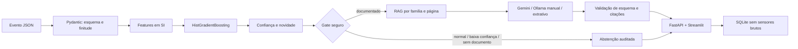
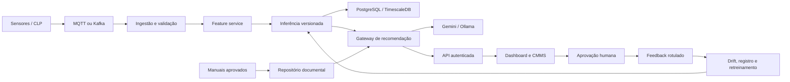

# Arquitetura e evolução industrial

## MVP executado

A lógica está em `RecommendationService`; API e dashboard não duplicam regras. O gate acontece antes do provedor e garante que indisponibilidade ou prompt malicioso não ampliem a cobertura documental.

## Contratos e falhas seguras

| Situação | Resposta | Chamada de IA |
|---|---|---:|
| Família documentada, confiança suficiente | `supported` com citações | Sim |
| Família sem documento | `unsupported_documentation` | Não |
| Confiança abaixo de 0,65 ou novidade acima de 1 | `low_confidence` | Não |
| Operação normal ou motor parado | `normal_operation` | Não |
| Provedor remoto/local falha | Extrativo com as mesmas fontes | Somente a tentativa permitida |
| Citação fora dos trechos recuperados | Resposta rejeitada | Não publicada |

## Arquitetura industrial proposta

## Controles de produção

- Identidade: OAuth2/OIDC, papéis por planta e ativo, tokens curtos e trilha de aprovação.
- Proteção: TLS em trânsito, chaves em cofre, criptografia em repouso e segregação por unidade.
- Observabilidade: métricas de latência, erro, abstenção, confiança, novidade e provedor; correlação por `request_id`.
- ModelOps: registro imutável de modelo, dataset, código, limiares e relatório; promoção com aprovação.
- Drift: PSI/KS por atributo, mudança da mistura de classes e taxa de discordância humana.
- Operação: circuit breaker para provedores, filas para picos, cache apenas de documentos não sensíveis.
- Segurança funcional: nenhuma ordem de manutenção automática; a decisão final permanece humana.

## Escala de hardware

No computador atual, o pacote privilegia memória previsível e artefato compacto. Em uma estação com 32 GB e GPU de até 16 GB, a evolução pode incluir embeddings locais, reranking, explicações SHAP assíncronas e um modelo local maior, sempre preservando os mesmos gates e contratos.

